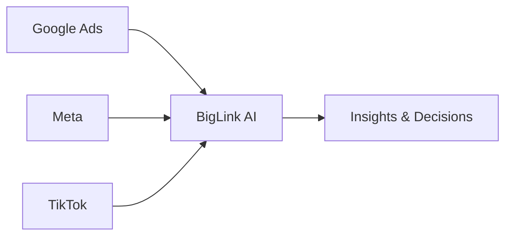

## Overview

BigLink empowers you to transform raw marketing data into actionable insights without spreadsheets or complex tools. Connect platforms like Google Ads, Meta, and TikTok to a unified dashboard. Ask natural language questions, and the AI agent delivers clear answers on key metrics like ROAS, CAC, and LTV. Customize views to focus on what matters, eliminating visual clutter.

<Callout kind="info">
BigLink's AI handles real-time analysis, so you get instant recommendations on scaling campaigns or cutting underperformers.
</Callout>

## Key Capabilities

Explore BigLink's core features through these highlighted areas:

<Columns cols={3}>
  <Card title="Conversational AI Agent" icon="bot" href="#ai-agent">
    Query your data in plain language. Get responses on performance, trends, and optimizations in seconds.
  </Card>
  <Card title="Unified Metrics Dashboard" icon="bar-chart-3" href="#dashboard">
    View ROAS, CAC, LTV across platforms in one place. No manual data merging required.
  </Card>
  <Card title="Plain Language Insights" icon="message-circle" href="#insights">
    Receive explanations without jargon. Decisions backed by clear, actionable advice.
  </Card>
  <Card title="Clutter-Free Customization" icon="sliders" href="#customization">
    Build dashboards tailored to your needs. Hide noise, highlight priorities.
  </Card>
</Columns>

## Using the AI Agent

Follow these steps to leverage BigLink's AI for real-time marketing insights:

<Steps>
  <Step title="Connect Your Platforms" icon="link">
    Integrate Google Ads, Meta, TikTok, and more via simple OAuth flows.

    <Image
      src="https://biglink.app/dashboard-ai-agent.png"
      alt="BigLink dashboard showing connected platforms"
      width="800"
      height="500"
    />
  </Step>
  <Step title="Ask a Question" icon="message-circle">
    Type queries like "What is my ROAS on Meta campaigns this week?"
  </Step>
  <Step title="Review Analysis" icon="zap">
    AI processes data instantly, providing metrics, trends, and recommendations.
  </Step>
  <Step title="Act on Insights" icon="trending-up">
    Scale winners or pause losers based on clear guidance.
  </Step>
</Steps>



## Metrics Deep Dive

BigLink excels at handling essential marketing metrics. Switch between views to explore:

<Tabs>
  <Tab title="ROAS" icon="dollar-sign">
    Return on Ad Spend measures revenue per ad dollar. Aim for `>4x` in mature campaigns.

    <ParamField path="campaigns.roas" param-type="number" required="true">
      Current ROAS value with historical trends.
    </ParamField>

    <CodeGroup tabs="Query Example">
      ```javascript
      // Example AI query response
      const insight = {
        roas: 5.2,
        recommendation: "Scale budget by 20%"
      };
      ```
    </CodeGroup>
  </Tab>
  <Tab title="CAC" icon="users">
    Customer Acquisition Cost tracks spend per new customer. Target `<{your LTV / 3}`.

    <ResponseField name="cac" field-type="number" required="true">
      Aggregated CAC across platforms.
    </ResponseField>
  </Tab>
  <Tab title="LTV" icon="trending-up">
    Lifetime Value predicts long-term customer revenue. Compare against CAC for sustainability.
  </Tab>
</Tabs>

## Dashboard Customization

Tailor your BigLink dashboard to avoid clutter:

<Expandable title="Advanced Customization Options" default-open="false">
  Use drag-and-drop widgets to prioritize metrics. Set filters for campaigns, dates, or platforms.

  ```json
  {
    "widgets": [
      {
        "type": "roas-chart",
        "platforms": ["google", "meta"],
        "timeframe": "30d"
      },
      {
        "type": "ai-insights",
        "query": "top performers"
      }
    ]
  }
  ```

  Save multiple layouts for different team roles.
</Expandable>

<Callout kind="tip">
Start with the default dashboard, then customize as you identify key metrics. Link to [Quickstart](/quickstart) for setup details.
</Callout>